# Firefly 博客写作指南

本指南将帮助你快速掌握如何使用 Firefly 模板编写和发布博客文章。

## 目录

- [项目概述](#项目概述)
- [快速开始](#快速开始)
- [创建文章](#创建文章)
- [文章 Front-matter](#文章-front-matter)
- [Markdown 基础语法](#markdown-基础语法)
- [代码块](#代码块)
- [高级功能](#高级功能)
- [Mermaid 图表](#mermaid-图表)
- [PlantUML 图表](#plantuml-图表)
- [数学公式 KaTeX](#数学公式-katex)
- [文章加密](#文章加密)
- [草稿功能](#草稿功能)
- [写作技巧](#写作技巧)
- [预览和发布](#预览和发布)
- [部署指南](#部署指南)
- [常见问题](#常见问题)

---

## 项目概述

**Firefly** 是一款基于 [Astro](https://astro.build/) 框架和 [Fuwari](https://github.com/saicaca/fuwari) 模板开发的清新美观且现代化个人博客主题模板。

### 技术栈

- **Astro** 6.x - 静态站点生成器
- **Tailwind CSS** 4.x - 实用优先的 CSS 框架
- **Svelte** - 交互式组件
- **TypeScript** - 类型安全
- **Pagefind** - 客户端搜索

### 主要特性

- 🚀 基于 Astro 的超快加载速度和 SEO 优化
- 🎨 简洁美观的界面，支持自定义主题色
- 📱 完美的响应式体验，移动端专项优化
- 🔧 高度可配置，大部分功能模块均可通过配置文件自定义
- 🌐 支持多语言（简体中文、繁体中文、英文、日文、俄文）
- 🔍 基于 Pagefind 的全文搜索
- 📝 丰富的 Markdown 扩展功能

---

## 快速开始

### 环境要求

- **Node.js** ≥ 22
- **pnpm** ≥ 9

### 安装步骤

```bash
# 1. 克隆仓库
git clone https://github.com/CuteLeaf/Firefly.git
cd Firefly

# 2. 安装 pnpm（如果没有安装）
npm install -g pnpm

# 3. 安装项目依赖
pnpm install

# 4. 启动开发服务器
pnpm dev
```

博客将在 `http://localhost:4321` 可用。

### 常用命令

| 命令 | 说明 |
|------|------|
| `pnpm install` | 安装依赖 |
| `pnpm dev` | 启动本地开发服务器 |
| `pnpm build` | 构建网站至 `./dist/` |
| `pnpm preview` | 本地预览已构建的网站 |
| `pnpm check` | 检查代码中的错误 |
| `pnpm format` | 使用 Biome 格式化代码 |
| `pnpm new-post <filename>` | 创建新文章 |
| `pnpm astro --help` | 显示 Astro CLI 帮助 |

---

## 创建文章

### 文章存放位置

所有文章文件都放在 `src/content/posts/` 目录中。

```
src/content/posts/
├── my-first-post.md          # 单文件文章
├── my-second-post/           # 带资源的文章（推荐）
│   ├── index.md              # 文章内容
│   └── cover.jpg             # 封面图或其他资源
└── guide/                    # 子目录分类
    └── getting-started.md
```

### 快速创建文章

在项目根目录运行：

```bash
pnpm new-post <filename>
```

例如：

```bash
pnpm new-post my-awesome-post
```

### 文章目录结构建议

```
src/content/posts/
└── my-awesome-post/
    ├── index.md              # 文章内容
    ├── cover.avif            # 封面图
    └── images/               # 文章配图目录
        ├── screenshot1.avif
        └── screenshot2.avif
```

---

## 文章 Front-matter

每篇文章开头必须包含 YAML front-matter，用于配置文章元数据。

### 基础示例

```yaml
---
title: 文章标题
published: 2024-01-01
description: 文章的简短描述，显示在首页
tags: [标签1, 标签2]
category: 分类名称
draft: false
---
```

### 完整属性列表

| 属性 | 描述 | 是否必填 | 示例 |
|------|------|----------|------|
| `title` | 文章标题 | ✅ 必填 | `我的第一篇文章` |
| `published` | 发布日期 | ✅ 必填 | `2024-01-01` |
| `updated` | 更新日期 | 可选 | `2024-01-15` |
| `description` | 文章描述，显示在首页 | 推荐 | `这是一篇关于...的文章` |
| `image` | 封面图路径 | 可选 | 见下方图片说明 |
| `tags` | 文章标签（数组） | 推荐 | `[前端, Vue, 教程]` |
| `category` | 文章分类 | 推荐 | `前端开发` |
| `pinned` | 是否置顶 | 可选 | `true` 或 `false` |
| `draft` | 是否为草稿（不显示） | 可选 | `true` 或 `false` |
| `slug` | 自定义 URL 路径 | 可选 | `my-custom-url` |
| `author` | 文章作者 | 可选 | `Xinghe` |
| `lang` | 文章语言（与网站语言不同时设置） | 可选 | `zh-CN`、`en`、`ja` |
| `comment` | 是否允许评论 | 可选 | `true` 或 `false` |
| `password` | 文章密码加密 | 可选 | `123456` |
| `passwordHint` | 密码提示 | 可选 | `提示：我的生日` |
| `licenseName` | 许可证名称 | 可选 | `未授权`、`MIT` |
| `licenseLink` | 许可证链接 | 可选 | `https://...` |
| `sourceLink` | 原文链接 | 可选 | `https://...` |

### 封面图配置

`image` 属性支持三种路径格式：

```yaml
# 1. 网络图片
image: "https://example.com/cover.jpg"

# 2. public 目录图片（以 / 开头）
image: "/assets/images/cover.jpg"

# 3. 相对路径（相对于文章文件）
image: "./cover.jpg"
image: "./images/cover.avif"

# 4. 使用随机封面图
image: "api"
```

### URL Slug 配置

```yaml
# 使用文件名作为 URL
# 文件：my-first-post.md
# URL：/posts/my-first-post

# 自定义 URL
slug: hello-world
# URL：/posts/hello-world
```

**Slug 建议**：
- 使用英文和连字符：`my-awesome-post`
- 保持简洁且具有描述性
- 避免特殊字符和空格
- 发布后尽量不要修改，以免影响 SEO

### 语言配置

如果文章语言与 `siteConfig.ts` 中的网站语言不同，需要设置 `lang` 属性：

```yaml
---
title: Hello World
lang: en  # 英文文章
---
```

支持的语言代码：
- `zh-CN` - 简体中文
- `zh-TW` - 繁体中文
- `en` - 英文
- `ja` - 日文
- `ru` - 俄文

---

## Markdown 基础语法

### 标题

```markdown
# 一级标题
## 二级标题
### 三级标题
#### 四级标题
##### 五级标题
###### 六级标题
```

### 文本格式

```markdown
**粗体文本**
*斜体文本*
***粗斜体文本***
~~删除线~~
`行内代码`
```

### 链接和图片

```markdown
[链接文字](https://example.com)


```

### 列表

```markdown
# 无序列表
- 项目一
- 项目二
  - 子项目
  - 子项目

# 有序列表
1. 第一步
2. 第二步
3. 第三步

# 任务列表
- [x] 已完成任务
- [ ] 未完成任务
```

### 引用

```markdown
> 这是一段引用文字
> 
> > 嵌套引用
```

### 表格

```markdown
| 左对齐 | 居中对齐 | 右对齐 |
|:-------|:--------:|-------:|
| 内容   |   内容   |   内容 |
```

### 分割线

```markdown
---
```

### 自动链接

```markdown
<http://example.com/>
<address@example.com>
```

---

## 代码块

### 基础代码块

````markdown
```javascript
console.log('Hello World!')
```
````

### 带标题的代码块

````markdown
```js title="main.js"
function hello() {
  console.log('Hello!')
}
```
````

### 显示行号

````markdown
```js showLineNumbers
function hello() {
  console.log('Line 1')
  console.log('Line 2')
}
```
````

### 自定义起始行号

````markdown
```js showLineNumbers startLineNumber=10
console.log('这是第 10 行')
console.log('这是第 11 行')
```
````

### 代码高亮标记

````markdown
```js {1, 3-5}
// 第1行高亮
const a = 1
// 第3-5行高亮
const b = 2
const c = 3
const d = 4
```
````

### 选择行标记类型 (mark, ins, del)

````markdown
```js title="example.js" del={2} ins={3-4} {6}
function demo() {
  console.log('此行标记为已删除')
  // 此行和下一行标记为已插入
  console.log('这是第二个插入行')

  return '此行使用中性默认标记类型'
}
```
````

### 为行标记添加标签

````markdown
```jsx {"1":5} del={"2":7-8} ins={"3":10-12}
<button
  role="button"
  {...props}
  value={value}
  className={buttonClassName}
  disabled={disabled}
  active={active}
>
  {children &&
    !active &&
    (typeof children === 'string' ? <span>{children}</span> : children)}
</button>
```
````

### 使用类似 diff 的语法

````markdown
```diff
+此行将标记为已插入
-此行将标记为已删除
这是常规行
```
````

### 结合语法高亮和 diff 语法

````markdown
```diff lang="js"
  function thisIsJavaScript() {
    // 整个块都会以 JavaScript 高亮显示，
    // 并且我们仍然可以为其添加 diff 标记！
-   console.log('要删除的旧代码')
+   console.log('新的闪亮代码！')
  }
```
````

### 标记行内的单独文本

````markdown
```js "given text"
function demo() {
  // 标记行内的任何给定文本
  return '支持给定文本的多个匹配项';
}
```
````

### 正则表达式标记

````markdown
```ts /ye[sp]/
console.log('单词 yes 和 yep 将被标记。')
```
````

### 折叠代码块

````markdown
```js collapse={1-5, 12-14}
// 所有这些样板设置代码将被折叠
import { someBoilerplateEngine } from '@example/some-boilerplate'
import { evenMoreBoilerplate } from '@example/even-more-boilerplate'

const engine = someBoilerplateEngine(evenMoreBoilerplate())

// 这部分代码默认可见
engine.doSomething(1, 2, 3, calcFn)

function calcFn() {
  // 您可以有多个折叠部分
  const a = 1
  const b = 2
  const c = a + b

  // 这将保持可见
  console.log(`计算结果: ${a} + ${b} = ${c}`)
  return c
}
```
````

### 自动换行

````markdown
```js wrap
// 启用换行的示例
function getLongString() {
  return '这是一个非常长的字符串，除非容器极宽，否则很可能无法适应可用空间'
}
```
````

### 终端代码块

````markdown
```bash
echo "此终端框架没有标题"
```

```powershell title="PowerShell 终端示例"
Write-Output "这个有标题!"
```
````

### 覆盖框架类型

````markdown
```sh frame="none"
echo "看，没有框架!"
```

```ps frame="code" title="PowerShell Profile.ps1"
# 如果不覆盖，这将是一个终端框架
function Watch-Tail { Get-Content -Tail 20 -Wait $args }
New-Alias tail Watch-Tail
```
````

### 渲染 ANSI 转义序列

````markdown
```ansi
[1;4mStandard ANSI colors:[0m
- Dimmed:     [2;30m Black [2;31m Red [2;32m Green [2;33m Yellow [2;34m Blue [2;35m Magenta [2;36m Cyan [2;37m White [0m
- Foreground: [30m Black [31m Red [32m Green [33m Yellow [34m Blue [35m Magenta [36m Cyan [37m White [0m
```
````

---

## 高级功能

### GitHub 仓库卡片

````markdown
::github{repo="CuteLeaf/Firefly"}
````

显示效果：

::github{repo="CuteLeaf/Firefly"}

### 提醒框（Admonitions）

Firefly 支持三种风格的提醒框主题：`GitHub`、`Obsidian` 和 `VitePress`。可以在 `src/config/siteConfig.ts` 中配置。

#### GitHub 主题风格（默认）

```markdown
> [!NOTE] 注意
> 这是一条提示信息

> [!TIP] 提示
> 这是一条技巧提示

> [!IMPORTANT] 重要
> 这是重要信息

> [!WARNING] 警告
> 这是警告信息

> [!CAUTION] 注意
> 这是注意事项

> [!NOTE] 自定义标题
> 这是一个带有自定义标题的示例。
```

#### Obsidian 主题风格

Obsidian 风格支持非常丰富的类型：

```markdown
> [!NOTE] NOTE
> 通用的笔记块。

> [!ABSTRACT] ABSTRACT
> 文章的摘要。

> [!SUMMARY] SUMMARY
> 文章的总结（同 Abstract）。

> [!TLDR] TLDR
> 太长不看（同 Abstract）。

> [!INFO] INFO
> 提供额外信息。

> [!TODO] TODO
> 需要完成的事项。

> [!TIP] TIP
> 实用技巧或提示。

> [!HINT] HINT
> 暗示（同 Tip）。

> [!SUCCESS] SUCCESS
> 操作成功。

> [!CHECK] CHECK
> 检查通过（同 Success）。

> [!DONE] DONE
> 已完成（同 Success）。

> [!QUESTION] QUESTION
> 提出问题。

> [!HELP] HELP
> 寻求帮助（同 Question）。

> [!FAQ] FAQ
> 常见问题（同 Question）。

> [!WARNING] WARNING
> 警告信息。

> [!CAUTION] CAUTION
> 注意事项（同 Warning）。

> [!ATTENTION] ATTENTION
> 引起注意（同 Warning）。

> [!FAILURE] FAILURE
> 操作失败。

> [!FAIL] FAIL
> 失败（同 Failure）。

> [!MISSING] MISSING
> 缺失内容（同 Failure）。

> [!DANGER] DANGER
> 危险操作警告。

> [!ERROR] ERROR
> 错误信息（同 Danger）。

> [!BUG] BUG
> 报告软件缺陷。

> [!EXAMPLE] EXAMPLE
> 展示一个例子。

> [!QUOTE] QUOTE
> 引用一段话。

> [!CITE] CITE
> 引证（同 Quote）。
```

#### VitePress 主题风格

```markdown
> [!NOTE] NOTE
> 对应 GitHub 的 Note。

> [!TIP] TIP
> 对应 GitHub 的 Tip。

> [!IMPORTANT] IMPORTANT
> 对应 GitHub 的 Important。

> [!WARNING] WARNING
> 对应 GitHub 的 Warning。

> [!CAUTION] CAUTION
> 对应 GitHub 的 Caution。
```

#### Docusaurus 风格语法

```markdown
:::note
突出显示用户应该考虑的信息。
:::

:::tip
可选信息，帮助用户更成功。
:::

:::important
用户成功所必需的关键信息。
:::

:::warning
由于潜在风险需要用户立即注意的关键内容。
:::

:::caution
行动的负面潜在后果。
:::

:::tip[自定义标题]
可选信息，帮助用户更成功。
:::
```

### 剧透（Spoiler）

```markdown
这是一个剧透内容：:spoiler[这里是隐藏的内容]！

支持 **Markdown** 语法：:spoiler[**粗体** 和 *斜体*]
```

### 图片画廊网格

```markdown
[grid]


[/grid]
```

支持 2-4 张图片并排展示，自动对齐高度。图片会自动使用 object-cover 进行完美中心裁剪。

### 嵌入视频

#### YouTube 视频

```html
<iframe width="100%" height="468" 
  src="https://www.youtube.com/embed/VIDEO_ID" 
  title="YouTube video player" 
  frameborder="0" 
  allow="accelerometer; autoplay; clipboard-write; encrypted-media; gyroscope; picture-in-picture" 
  allowfullscreen>
</iframe>
```

#### Bilibili 视频

```html
<iframe width="100%" height="468" 
  src="//player.bilibili.com/player.html?bvid=BV1fK4y1s7Qf&p=1&autoplay=0" 
  scrolling="no" 
  border="0" 
  frameborder="no" 
  framespacing="0" 
  allowfullscreen="true">
</iframe>
```

---

## Mermaid 图表

Mermaid 支持多种图表类型，适合展示流程图、时序图、甘特图等。

### 流程图（Flowchart）

````markdown
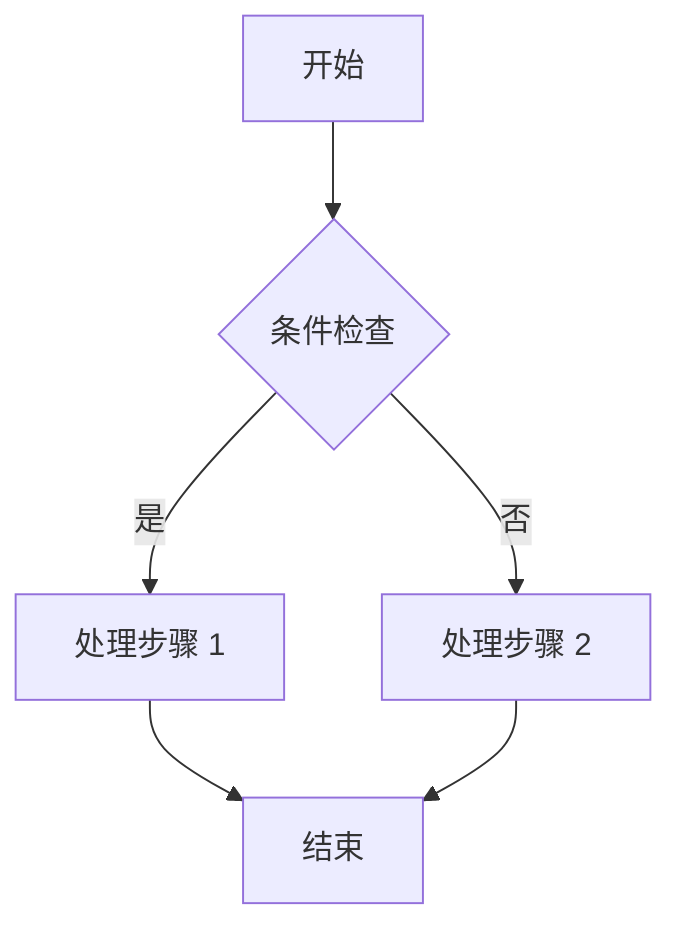
````

### 时序图（Sequence Diagram）

````markdown
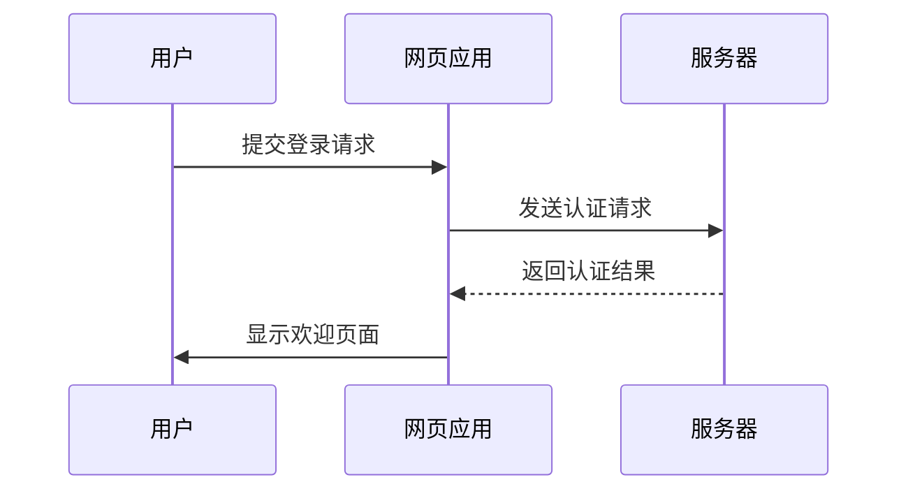
````

### 甘特图（Gantt Chart）

````markdown
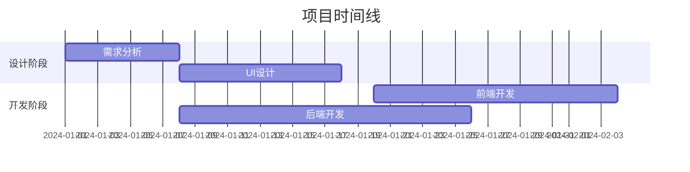
````

### 类图（Class Diagram）

````markdown
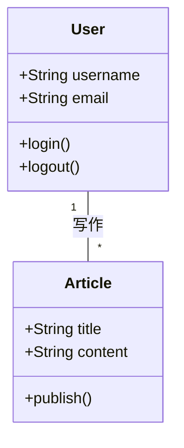
````

### 状态图（State Diagram）

````markdown
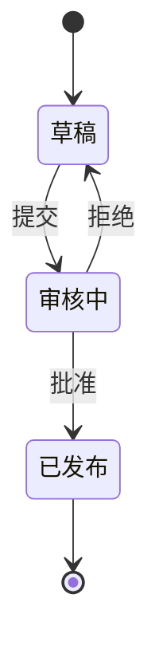
````

### 饼图（Pie Chart）

````markdown
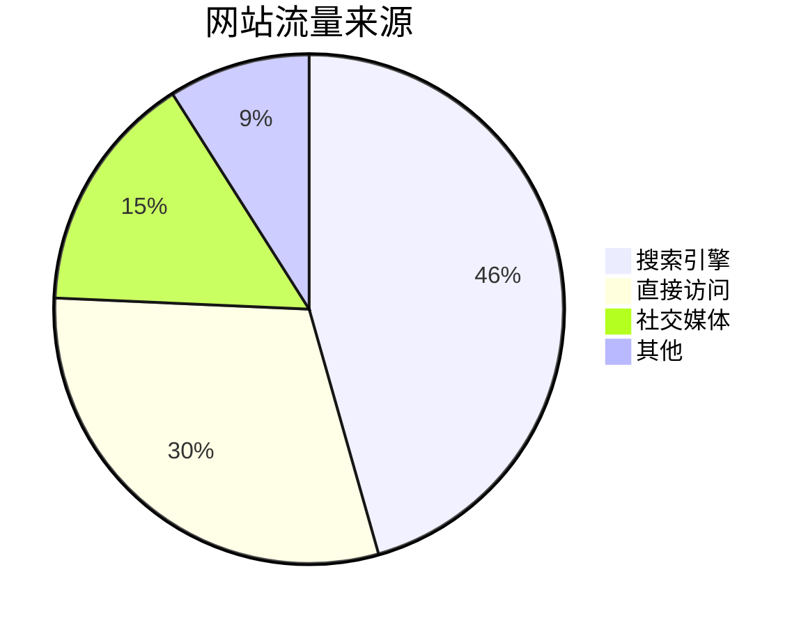
````

---

## PlantUML 图表

PlantUML 适合绘制更专业的工程图表，如活动图、用例图、组件图等。

### 活动图（Activity Diagram）

````markdown
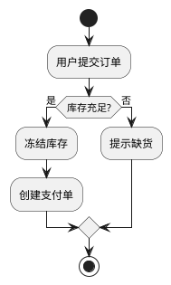
````

### 用例图（Use Case Diagram）

````markdown
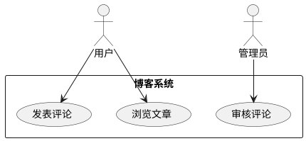
````

### 组件图（Component Diagram）

````markdown
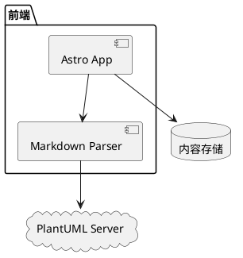
````

### ER 图（Entity Relationship Diagram）

````markdown
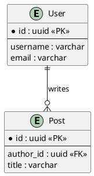
````

### 时序图（Sequence Diagram）

````markdown
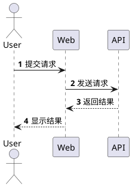
````

---

## 数学公式 KaTeX

### 行内公式

使用单个 `$` 包裹，与文字同行：

```markdown
欧拉公式 $e^{i\pi} + 1 = 0$ 是最优美的数学公式。

质能方程 $E = mc^2$ 也很著名。
```

### 块级公式

使用两个 `$$` 包裹，独立成行：

```markdown
$$
\int_{-\infty}^{\infty} e^{-x^2} dx = \sqrt{\pi}
$$

$$
x = \frac{-b \pm \sqrt{b^2 - 4ac}}{2a}
$$
```

### 矩阵

```markdown
$$
\begin{pmatrix}
a & b \\
c & d
\end{pmatrix}
$$
```

### 求和与极限

```markdown
$$
\sum_{n=1}^{\infty} \frac{1}{n^2} = \frac{\pi^2}{6}
$$

$$
\lim_{x \to 0} \frac{\sin x}{x} = 1
$$
```

### 化学方程式

```markdown
$$
\ce{CH4 + 2O2 -> CO2 + 2H2O}
$$
```

### 常用符号表

| 符号 | 代码 | 说明 |
|------|------|------|
| $\alpha$ | `\alpha` | 阿尔法 |
| $\beta$ | `\beta` | 贝塔 |
| $\Gamma$ | `\Gamma` | 伽马（大写） |
| $\pi$ | `\pi` | 派 |
| $\infty$ | `\infty` | 无穷大 |
| $\rightarrow$ | `\rightarrow` | 右箭头 |
| $\partial$ | `\partial` | 偏导数 |
| $\sum$ | `\sum` | 求和 |
| $\int$ | `\int` | 积分 |
| $\sqrt{}$ | `\sqrt{}` | 平方根 |

---

## 文章加密

### 配置加密

```yaml
---
title: 加密文章
published: 2024-01-01
password: "123456"
passwordHint: "提示：我的生日"
---
```

### 加密特性

- **构建时加密**：使用 AES-256-GCM 算法加密，源码中不包含明文
- **客户端解密**：访客输入密码后在浏览器本地解密
- **会话缓存**：密码缓存到 `sessionStorage`，刷新无需重复输入
- **关闭即失效**：关闭浏览器后缓存清除

### 加密文章支持的内容

加密文章中可以使用所有 Markdown 功能：
- 图片、代码块、GitHub 卡片
- 提醒框、数学公式、Mermaid 图表
- 所有高级功能都正常工作

---

## 草稿功能

### 设置草稿

```yaml
---
title: 草稿文章
published: 2024-01-01
draft: true
---
```

### 草稿特性

- 开发模式（`pnpm dev`）下可见
- 构建发布（`pnpm build`）时不会包含
- 适合正在编写中的文章

### 发布草稿

将 `draft: true` 改为 `draft: false` 即可发布。

---

## 写作技巧

### 文章结构建议

```markdown
---
# Front-matter
---

# 引言（简短介绍文章内容）

## 第一部分
内容...

## 第二部分
内容...

## 总结
总结全文...
```

### 图片使用建议

- 使用 `src/content/posts/文章目录/` 存放文章配图
- 使用相对路径引用：`./images/photo.jpg`
- 推荐格式：`.avif` 或 `.webp`（体积更小）
- 添加有意义的 `alt` 文本
- 图片画廊使用 `[grid]` 标签展示多张图片

### 标签和分类建议

- 标签：具体技术或主题，如 `Vue`、`React`、`教程`
- 分类：大的领域划分，如 `前端开发`、`后端开发`、`生活随笔`
- 每篇文章 2-5 个标签为宜

### 代码块使用建议

- 始终指定语言标识，以获得正确的语法高亮
- 使用 `title` 属性标注文件名
- 使用 `showLineNumbers` 显示行号
- 使用 `{1, 3-5}` 标记重要代码行
- 长代码使用 `collapse` 折叠不重要的部分
- 使用 `diff` 语法展示代码变更

### 链接使用建议

- 内部链接使用相对路径：`[关于](/about/)`
- 外部链接使用完整 URL：`[Google](https://google.com)`
- 引用式链接适合重复使用的链接

---

## 预览和发布

### 本地预览

```bash
pnpm dev
```

访问 http://localhost:4321/ 预览博客。

### 构建发布

```bash
pnpm build
```

构建后的文件在 `dist/` 目录，可部署到任何静态托管服务。

### 检查和格式化

提交前请运行：

```bash
pnpm check    # 检查错误
pnpm format   # 格式化代码
```

---

## 部署指南

### 平台托管部署

参考 [Astro 官方部署指南](https://docs.astro.build/zh-cn/guides/deploy/) 将博客部署至以下平台：

- **Vercel**
- **Netlify**
- **Cloudflare Pages**
- **EdgeOne Pages**
- **GitHub Pages**

### Vercel 部署

1. Fork 仓库到你的 GitHub
2. 在 Vercel 中导入项目
3. 配置：
   - 框架预设：`Astro`
   - 根目录：`./`
   - 输出目录：`dist`
   - 构建命令：`pnpm run build`
   - 安装命令：`pnpm install`
4. 点击 Deploy

### Netlify 部署

1. Fork 仓库到你的 GitHub
2. 在 Netlify 中导入项目
3. 配置同上
4. 点击 Deploy

---

## 常见问题

### Q: 如何设置草稿？

设置 `draft: true`，文章在开发模式可见，但构建时不会包含。

### Q: 如何修改文章顺序？

- 按发布日期排序（最新的在前）
- 使用 `pinned: true` 置顶重要文章

### Q: 图片不显示怎么办？

- 检查路径是否正确
- 确保图片在 `src/content/posts/` 目录或 `public/` 目录
- 检查文件名大小写是否匹配
- 推荐使用 `.avif` 或 `.webp` 格式

### Q: 如何在文章中嵌入视频？

使用 HTML `<iframe>` 标签嵌入 YouTube 或 Bilibili 视频。

### Q: 如何绘制图表？

- 简单图表使用 Mermaid（流程图、时序图、甘特图等）
- 专业图表使用 PlantUML（活动图、用例图、组件图、ER 图等）

### Q: 如何写数学公式？

- 行内公式使用 `$...$`
- 块级公式使用 `$$...$$`
- 支持 KaTeX 语法和化学方程式（`\ce{}`）

### Q: 如何配置提醒框风格？

在 `src/config/siteConfig.ts` 中配置 `rehypeCallouts.theme`：

```typescript
rehypeCallouts: {
  // 选项: "github" | "obsidian" | "vitepress"
  theme: "github",
},
```

**注意：更改配置后需要重启开发服务器才能生效。**

### Q: 如何添加多语言支持？

在文章 front-matter 中设置 `lang` 属性：

```yaml
---
title: Hello World
lang: en
---
```

### Q: 如何自定义文章 URL？

使用 `slug` 属性：

```yaml
---
title: 我的文章
slug: my-custom-url
---
```

URL 将变为 `/posts/my-custom-url`

### Q: 如何禁用文章评论？

在 front-matter 中设置 `comment: false`：

```yaml
---
title: 我的文章
comment: false
---
```

---

## 参考资料

- [Firefly 官方文档](https://docs-firefly.cuteleaf.cn/)
- [Firefly 在线预览](https://firefly.cuteleaf.cn/)
- [Firefly GitHub 仓库](https://github.com/CuteLeaf/Firefly)
- [Astro 官方文档](https://docs.astro.build/)
- [Tailwind CSS 文档](https://tailwindcss.com/)
- [Mermaid 文档](https://mermaid.js.org/)
- [PlantUML 文档](https://plantuml.com/)
- [KaTeX 文档](https://katex.org/)
- [Expressive Code 文档](https://expressive-code.com/)

---

**更多帮助**：查看 [Firefly 官方文档](https://docs-firefly.cuteleaf.cn/) 和 [Astro 官方文档](https://docs.astro.build/)
