# Firefly 博客写作指南

本指南将帮助你快速掌握如何使用 Firefly 模板编写和发布博客文章。

## 1. 创建文章

### 文章存放位置

所有文章文件都放在 `src/content/posts/` 目录中。

```
src/content/posts/
├── my-first-post.md          # 单文件文章
├── my-second-post/           # 带资源的文章（推荐）
│   ├── index.md              # 文章内容
│   └── cover.jpg             # 封面图或其他资源
└── guide/                    # 子目录分类
    └── getting-started.md
```

### 快速创建文章

在项目根目录运行：

```bash
pnpm run new-post
```

## 2. 文章 Front-matter（必填）

每篇文章开头必须包含 YAML front-matter，用于配置文章元数据：

```yaml
---
title: 文章标题
published: 2024-01-01
description: 文章的简短描述，显示在首页
tags: [标签1, 标签2]
category: 分类名称
draft: false
---
```

### 完整属性列表

| 属性 | 描述 | 是否必填 | 示例 |
|------|------|----------|------|
| `title` | 文章标题 | ✅ 必填 | `我的第一篇文章` |
| `published` | 发布日期 | ✅ 必填 | `2024-01-01` |
| `updated` | 更新日期 | 可选 | `2024-01-15` |
| `description` | 文章描述，显示在首页 | 推荐 | `这是一篇关于...的文章` |
| `image` | 封面图路径 | 可选 | 见下方图片说明 |
| `tags` | 文章标签（数组） | 推荐 | `[前端, Vue, 教程]` |
| `category` | 文章分类 | 推荐 | `前端开发` |
| `pinned` | 是否置顶 | 可选 | `true` 或 `false` |
| `draft` | 是否为草稿（不显示） | 可选 | `true` 或 `false` |
| `slug` | 自定义 URL 路径 | 可选 | `my-custom-url` |
| `author` | 文章作者 | 可选 | `Xinghe` |
| `password` | 文章密码加密 | 可选 | `123456` |
| `passwordHint` | 密码提示 | 可选 | `提示：我的生日` |

### 封面图配置

`image` 属性支持三种路径格式：

```yaml
# 1. 网络图片
image: "https://example.com/cover.jpg"

# 2. public 目录图片（以 / 开头）
image: "/assets/images/cover.jpg"

# 3. 相对路径（相对于文章文件）
image: "./cover.jpg"
image: "./images/cover.avif"
```

### URL Slug 配置

```yaml
# 使用文件名作为 URL
# 文件：my-first-post.md
# URL：/posts/my-first-post

# 自定义 URL
slug: hello-world
# URL：/posts/hello-world
```

**Slug 建议**：
- 使用英文和连字符：`my-awesome-post`
- 保持简洁且具有描述性
- 避免特殊字符和空格
- 发布后尽量不要修改，以免影响 SEO

## 3. Markdown 基础语法

### 标题

```markdown
# 一级标题
## 二级标题
### 三级标题
```

### 文本格式

```markdown
**粗体文本**
*斜体文本*
~~删除线~~
`行内代码`
```

### 链接和图片

```markdown
[链接文字](https://example.com)


```

### 列表

```markdown
# 无序列表
- 项目一
- 项目二
  - 子项目

# 有序列表
1. 第一步
2. 第二步
3. 第三步
```

### 引用

```markdown
> 这是一段引用文字
> 
> > 嵌套引用
```

### 表格

```markdown
| 列1 | 列2 | 列3 |
|-----|-----|-----|
| 内容 | 内容 | 内容 |
```

### 分割线

```markdown
---
```

## 4. 代码块

### 基础代码块

````markdown
```javascript
console.log('Hello World!')
```
````

### 带标题的代码块

````markdown
```js title="main.js"
function hello() {
  console.log('Hello!')
}
```
````

### 显示行号

````markdown
```js showLineNumbers
function hello() {
  console.log('Line 1')
  console.log('Line 2')
}
```
````

### 代码高亮标记

````markdown
```js {1, 3-5}
// 第1行高亮
const a = 1
// 第3-5行高亮
const b = 2
const c = 3
const d = 4
```
````

### 折叠代码块

````markdown
```js collapse={1-3}
// 这部分会被折叠
import { something } from 'module'
const config = {}

// 这部分默认展开
console.log('Hello!')
```
````

### 终端代码块

````markdown
```bash
npm install
npm run dev
```
````

## 5. 高级功能

### GitHub 仓库卡片

````markdown
::github{repo="CuteLeaf/Firefly"}
````

### 提醒框（Admonitions）

```markdown
> [!NOTE] 注意
> 这是一条提示信息

> [!TIP] 提示
> 这是一条技巧提示

> [!IMPORTANT] 重要
> 这是重要信息

> [!WARNING] 警告
> 这是警告信息

> [!CAUTION]  caution
> 这是 caution 信息
```

### 剧透（Spoiler）

```markdown
这是一个剧透内容：:spoiler[这里是隐藏的内容]！
```

### 图片画廊网格

```markdown
[grid]


[/grid]
```

支持 2-4 张图片并排展示，自动对齐高度。

### 数学公式（KaTeX）

```markdown
# 行内公式
$E = mc^2$

# 块级公式
$$
\int_{0}^{\infty} e^{-x^2} dx = \frac{\sqrt{\pi}}{2}
$$
```

### Mermaid 图表

````markdown
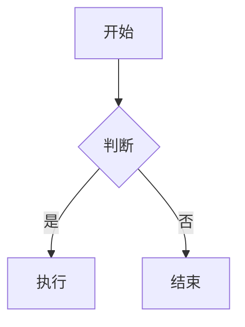
````

### PlantUML 图表

````markdown
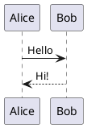
````

## 6. 嵌入视频

你可以在文章中嵌入 YouTube 或 Bilibili 视频：

```html
<!-- YouTube 视频 -->
<iframe width="100%" height="468" 
  src="https://www.youtube.com/embed/VIDEO_ID" 
  title="YouTube video player" 
  frameborder="0" 
  allow="accelerometer; autoplay; clipboard-write; encrypted-media; gyroscope; picture-in-picture" 
  allowfullscreen>
</iframe>

<!-- Bilibili 视频 -->
<iframe width="100%" height="468" 
  src="//player.bilibili.com/player.html?bvid=BV1fK4y1s7Qf&p=1&autoplay=0" 
  scrolling="no" 
  border="0" 
  frameborder="no" 
  framespacing="0" 
  allowfullscreen="true">
</iframe>
```

只需从视频平台复制嵌入代码，粘贴到 Markdown 文件中即可。

## 7. Mermaid 图表详细用法

Mermaid 支持多种图表类型，适合展示流程图、时序图、甘特图等。

### 流程图（Flowchart）

````markdown
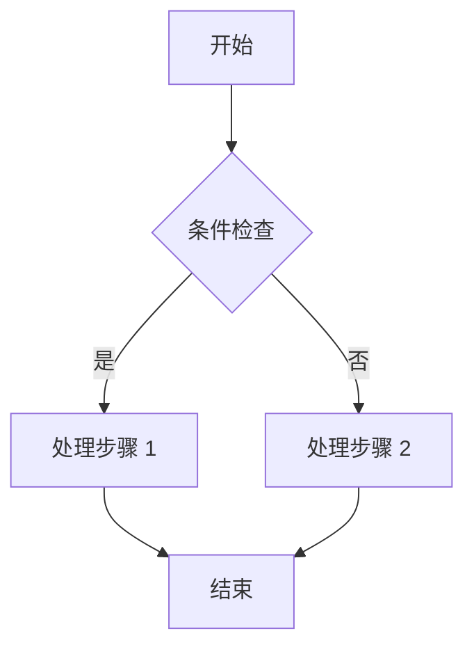
````

### 时序图（Sequence Diagram）

````markdown
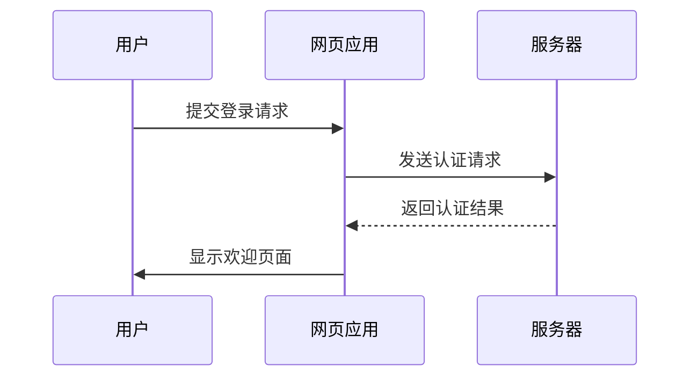
````

### 甘特图（Gantt Chart）

````markdown
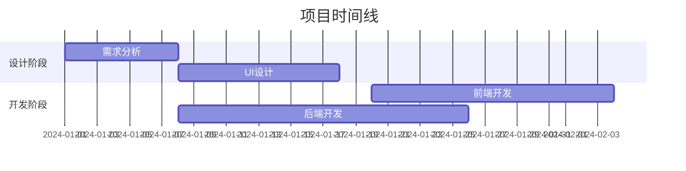
````

### 类图（Class Diagram）

````markdown
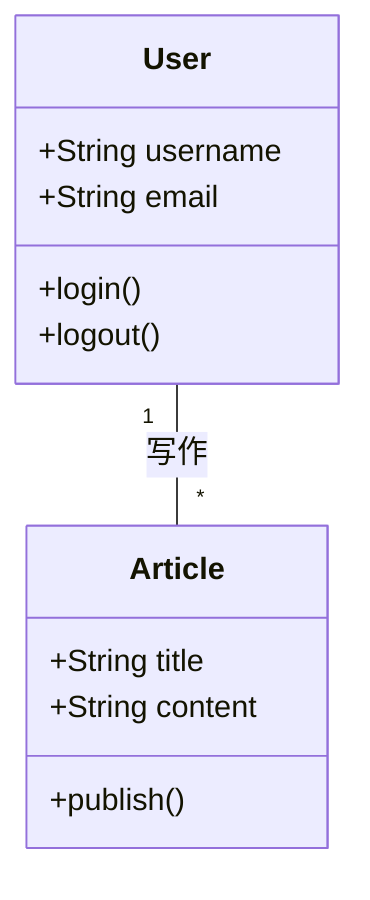
````

### 状态图（State Diagram）

````markdown
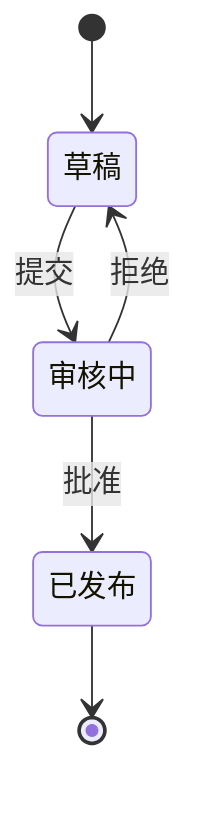
````

### 饼图（Pie Chart）

````markdown
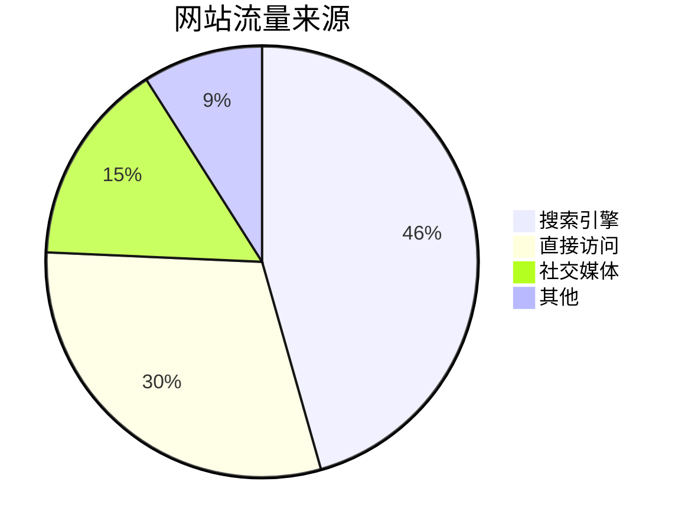
````

## 8. PlantUML 图表详细用法

PlantUML 适合绘制更专业的工程图表，如活动图、用例图、组件图等。

### 活动图（Activity Diagram）

````markdown
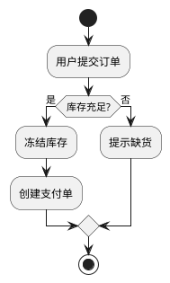
````

### 用例图（Use Case Diagram）

````markdown
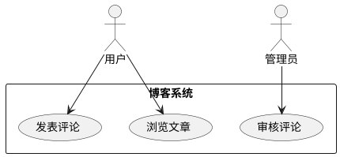
````

### 组件图（Component Diagram）

````markdown
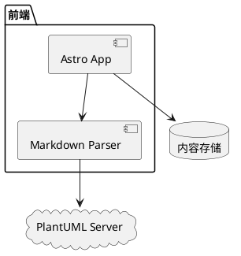
````

### ER 图（Entity Relationship Diagram）

````markdown
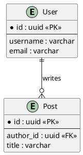
````

### 时序图（Sequence Diagram）

````markdown
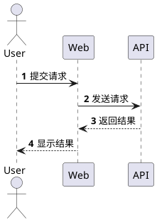
````

## 9. 数学公式（KaTeX）详细用法

### 行内公式

使用单个 `$` 包裹，与文字同行：

```markdown
欧拉公式 $e^{i\pi} + 1 = 0$ 是最优美的数学公式。

质能方程 $E = mc^2$ 也很著名。
```

### 块级公式

使用两个 `$$` 包裹，独立成行：

```markdown
$$
\int_{-\infty}^{\infty} e^{-x^2} dx = \sqrt{\pi}
$$

$$
x = \frac{-b \pm \sqrt{b^2 - 4ac}}{2a}
$$
```

### 矩阵

```markdown
$$
\begin{pmatrix}
a & b \\
c & d
\end{pmatrix}
$$
```

### 求和与极限

```markdown
$$
\sum_{n=1}^{\infty} \frac{1}{n^2} = \frac{\pi^2}{6}
$$

$$
\lim_{x \to 0} \frac{\sin x}{x} = 1
$$
```

### 化学方程式

```markdown
$$
\ce{CH4 + 2O2 -> CO2 + 2H2O}
$$
```

### 常用符号表

| 符号 | 代码 | 说明 |
|------|------|------|
| $\alpha$ | `\alpha` | 阿尔法 |
| $\beta$ | `\beta` | 贝塔 |
| $\Gamma$ | `\Gamma` | 伽马（大写） |
| $\pi$ | `\pi` | 派 |
| $\infty$ | `\infty` | 无穷大 |
| $\rightarrow$ | `\rightarrow` | 右箭头 |
| $\partial$ | `\partial` | 偏导数 |

## 10. 文章加密详细用法

### 配置加密

```yaml
---
title: 加密文章
published: 2024-01-01
password: "123456"
passwordHint: "提示：我的生日"
---
```

### 加密特性

- **构建时加密**：使用 AES-256-GCM 算法加密，源码中不包含明文
- **客户端解密**：访客输入密码后在浏览器本地解密
- **会话缓存**：密码缓存到 `sessionStorage`，刷新无需重复输入
- **关闭即失效**：关闭浏览器后缓存清除

### 加密文章支持的内容

加密文章中可以使用所有 Markdown 功能：
- 图片、代码块、GitHub 卡片
- 提醒框、数学公式、Mermaid 图表
- 所有高级功能都正常工作

## 11. 草稿功能

### 设置草稿

```yaml
---
title: 草稿文章
published: 2024-01-01
draft: true
---
```

### 草稿特性

- 开发模式（`pnpm dev`）下可见
- 构建发布（`pnpm build`）时不会包含
- 适合正在编写中的文章

### 发布草稿

将 `draft: true` 改为 `draft: false` 即可发布。

## 12. 写作技巧

### 文章结构建议

```markdown
---
# Front-matter
---

# 引言（简短介绍文章内容）

## 第一部分
内容...

## 第二部分
内容...

## 总结
总结全文...
```

### 图片使用建议

- 使用 `src/content/posts/文章目录/` 存放文章配图
- 使用相对路径引用：`./images/photo.jpg`
- 推荐格式：`.avif` 或 `.webp`（体积更小）
- 添加有意义的 `alt` 文本
- 图片画廊使用 `[grid]` 标签展示多张图片

### 标签和分类建议

- 标签：具体技术或主题，如 `Vue`、`React`、`教程`
- 分类：大的领域划分，如 `前端开发`、`后端开发`、`生活随笔`
- 每篇文章 2-5 个标签为宜

### 代码块使用建议

- 始终指定语言标识，以获得正确的语法高亮
- 使用 `title` 属性标注文件名
- 使用 `showLineNumbers` 显示行号
- 使用 `{1, 3-5}` 标记重要代码行
- 长代码使用 `collapse` 折叠不重要的部分

## 13. 预览和发布

### 本地预览

```bash
pnpm dev
```

访问 http://localhost:4321/ 预览博客。

### 构建发布

```bash
pnpm build
```

构建后的文件在 `dist/` 目录，可部署到任何静态托管服务。

## 14. 常见问题

### Q: 如何设置草稿？

设置 `draft: true`，文章在开发模式可见，但构建时不会包含。

### Q: 如何修改文章顺序？

- 按发布日期排序（最新的在前）
- 使用 `pinned: true` 置顶重要文章

### Q: 图片不显示怎么办？

- 检查路径是否正确
- 确保图片在 `src/content/posts/` 目录或 `public/` 目录
- 检查文件名大小写是否匹配

### Q: 如何在文章中嵌入视频？

使用 HTML `<iframe>` 标签嵌入 YouTube 或 Bilibili 视频。

### Q: 如何绘制图表？

- 简单图表使用 Mermaid（流程图、时序图、甘特图等）
- 专业图表使用 PlantUML（活动图、用例图、组件图、ER 图等）

### Q: 如何写数学公式？

- 行内公式使用 `$...$`
- 块级公式使用 `$$...$$`
- 支持 KaTeX 语法和化学方程式（`\ce{}`）

---

**更多帮助**：查看 [Firefly 官方文档](https://docs-firefly.cuteleaf.cn/) 和 [Astro 官方文档](https://docs.astro.build/)
